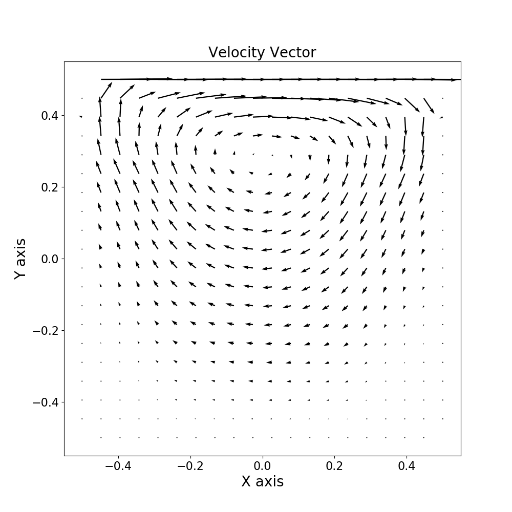

# Radial basis function collocation method (RBFCM) in computational fluid dynamics

## Introduction
**RBFCM_CFD** is a simple CFD project that solves some classical fluid prolbems. It is designed to be modified easily by students  interested in learning meshless method. More features will be added in the future.
***
## Brief theoretical description

The local radial-basis-function collocation method
(LRBFCM) that based on the multiquadric type radial basis function is used to discretize the spatial
derivitives of the governing equations. As a result, a meshless numerical method is developed for
solving problems. The meshless numerical method is much simpler compared with the traditional numerical methods, such as the finite difference method and the finite element method.

***
## Program Structure

* **GMMMQBasis2D.h** \
A class define the shape parameter when it is initialize. Compute the linear operation of the radial basis function and return it to **Collocation2D.h**.

* **Collocation2D.h** \
A fucntion collocate the nodes near the target node and return the local vector of this node cloud.
note: the first index indicate the target node.

* **GMMRectangular.h** \
A class generate a retangular domain with orthogonal node distribution. The nodes on the corner are neglected.

***
## Examples

1. **Laplace equation** \
Laplace equation is solved in a rectangular domain with dirichlet boundary conditions on all sides.

2. **Navier Stokes equation** \
The projection method is used to solve the Navier Stokes equation. A lid-driven square cavity flow case is presented here.

 
***

## Dependencies
The following open source libraries or third party functions are used by this project:
- [Gmm++](http://getfem.org/gmm.html) library for matrix manipulation.
- [nanoflann](https://github.com/jlblancoc/nanoflann) is a C++ header-only library for building KD-Trees.
***
## References
[1] Tsai, C.-C., Lin, Z.-H., & Hsu, T.-W. (2015). [Using a local radial basis function collocation method to approximate radiation boundary conditions](https://doi.org/10.1016/j.oceaneng.2015.06.030). Ocean Engineering, 105, 231–241. 

[2] Chen, W., Zhuo. & Chen, C. (2014). Recent advances on radial basis function collocation methods. Berlin: Springer.